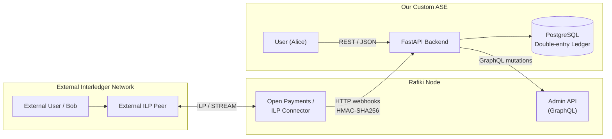
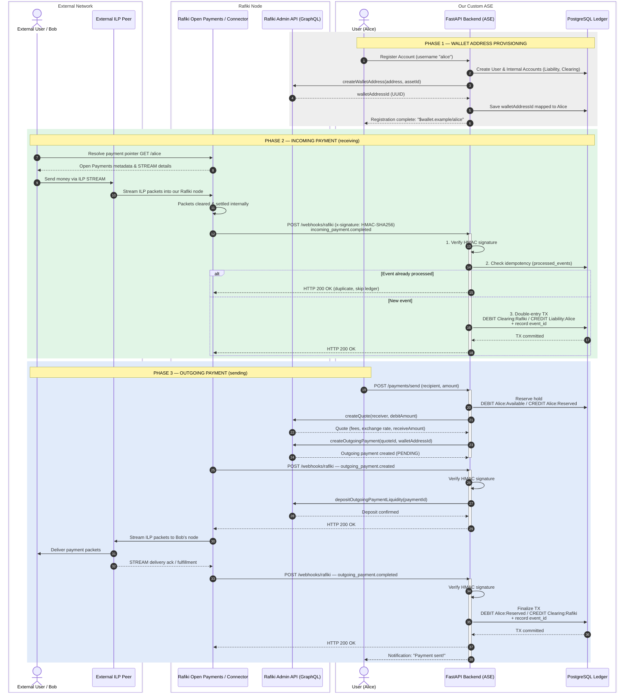
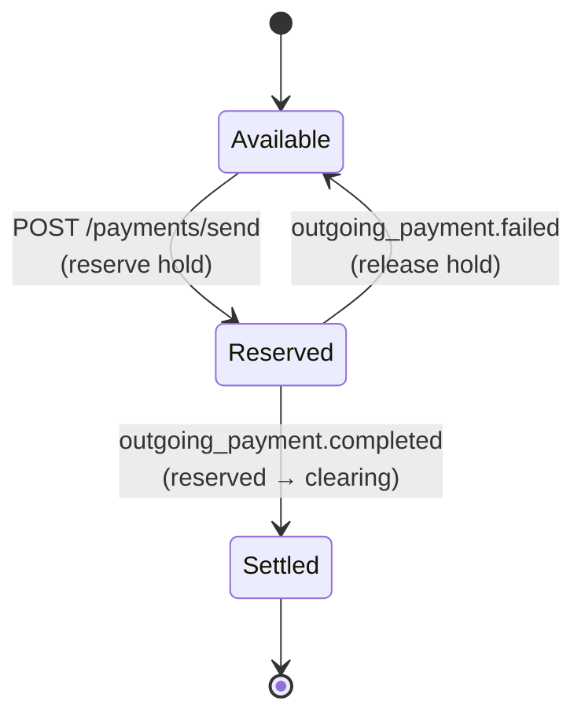
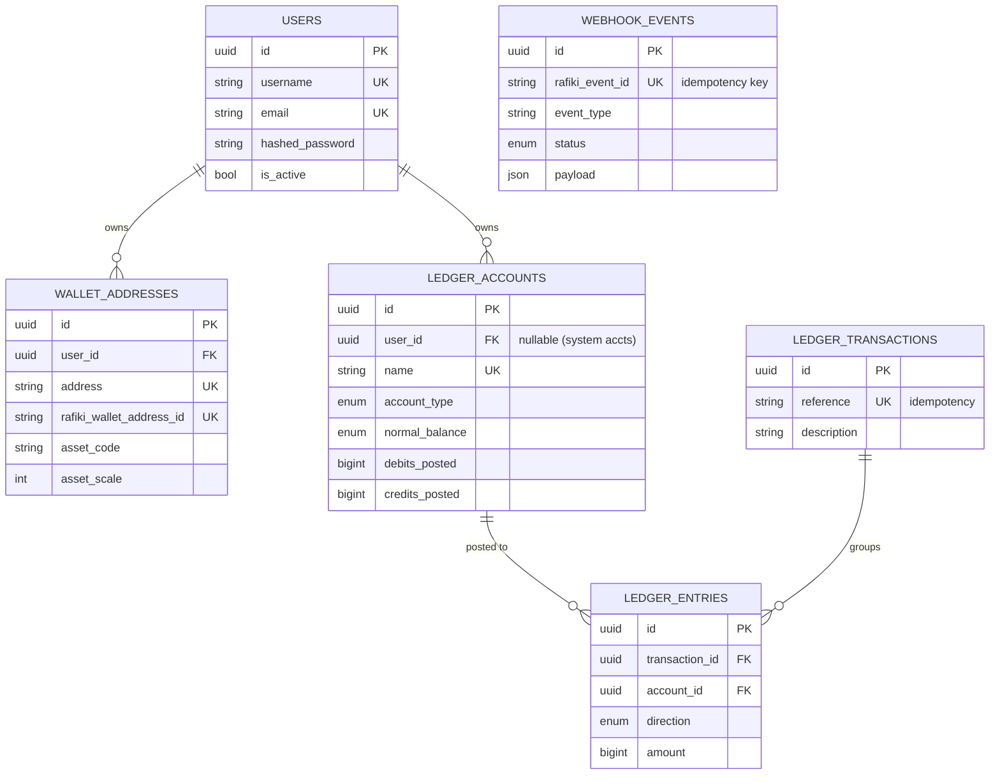
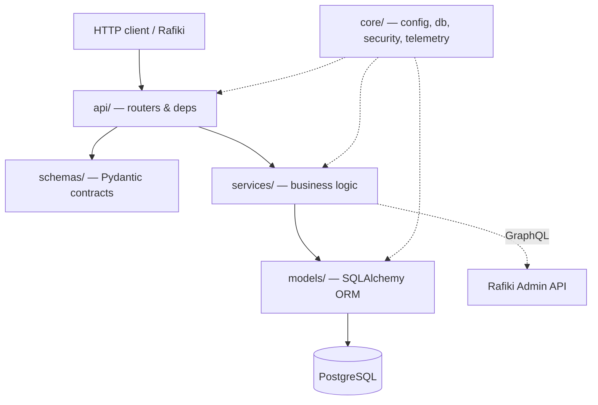

# Custom ILP ASE — Architecture

**Account Servicing Entity for the Interledger Protocol, built on Rafiki.**

Version 0.1.0 · Phase 1 (basic setup) · 2026-10-04

---

## 1. Overview

This service is an **Account Servicing Entity (ASE)**: the party that holds and
services customer accounts. It sits in front of a [Rafiki](https://rafiki.dev)
node, which speaks the Interledger Protocol (ILP) to the outside world. The two
systems are deliberately **decoupled**:

- **Rafiki** clears and settles ILP/STREAM packets across the network. It does
  **not** store customer balances.
- **This ASE** is the **single source of truth** for balances, authentication,
  and accounting. It owns a **double-entry ledger**.

They communicate over exactly two channels:

| Direction | Channel | Used for |
|-----------|---------|----------|
| ASE → Rafiki | GraphQL **Admin API** | Create wallet addresses, quotes, outgoing payments, deposit liquidity |
| Rafiki → ASE | HTTP **webhooks** (HMAC-signed) | Notify of payment lifecycle events |

### Design principles

1. **The ledger is sacrosanct.** Money only moves through balanced, double-entry
   transactions (`sum(debits) == sum(credits)`). There is no
   `balance = balance + X`.
2. **Integer money.** Amounts are integers in the asset's minor units
   (Open Payments style): with `assetScale = 2`, the value `1000` means `$10.00`.
3. **Idempotent by construction.** Every inbound webhook is deduplicated by a
   unique event id so Rafiki's retries never double-post.
4. **Verified origin.** Every webhook is authenticated with HMAC-SHA256 before it
   can touch the ledger.
5. **Clean architecture.** HTTP → services → models, with clear seams and no
   business logic in the transport layer.

---

## 2. System context



### Actors and components

| Component | Responsibility |
|-----------|----------------|
| **External User / Peer** | Sends/receives money over the Interledger network. |
| **Rafiki Open Payments / Connector** | Resolves payment pointers, clears & settles ILP STREAM packets, emits webhooks. |
| **Rafiki Admin API (GraphQL)** | Management surface: wallet addresses, quotes, outgoing payments, liquidity. |
| **FastAPI Backend (ASE)** | Authentication, accounting, webhook processing, Rafiki orchestration. |
| **PostgreSQL Ledger** | Durable store for users, wallets, the double-entry ledger, and webhook idempotency records. |

---

## 3. Core flows

### 3.1 Provisioning (wallet-address creation)

A new user is registered, their internal ledger accounts are created, and a
wallet address is provisioned in Rafiki. The returned `walletAddressId` is stored
and mapped to the user.

### 3.2 Incoming payment (receiving)

Rafiki clears an inbound STREAM, then fires `incoming_payment.completed`. The ASE
verifies the signature, checks idempotency, and posts
`DEBIT clearing:rafiki` / `CREDIT liability:<user>:available`.

### 3.3 Outgoing payment (sending)

The user requests a send. The ASE places a **reserve hold**
(`available → reserved`), creates a quote and an outgoing payment in Rafiki, funds
liquidity on `outgoing_payment.created`, and finalizes on
`outgoing_payment.completed` (`reserved → clearing:rafiki`).

### 3.4 End-to-end sequence



---

## 4. The double-entry ledger

### 4.1 Accounts

A customer's spendable money is a **liability** of the ASE — we owe it to them —
so customer accounts are **credit-normal**. The Rafiki clearing account tracks the
settlement position and is **debit-normal**.

| Account | Type | Normal balance | Purpose |
|---------|------|----------------|---------|
| `liability:<user>:available` | liability | credit | Spendable customer balance |
| `liability:<user>:reserved` | liability | credit | Funds held pending an outgoing payment |
| `clearing:rafiki` | clearing | debit | Net settlement position vs. the Rafiki node |

### 4.2 Invariants

- Every transaction has **≥ 2 postings** and **`sum(debits) == sum(credits)`**.
- Entries are **append-only** — never updated or deleted.
- Each account caches `debits_posted` / `credits_posted`. These counters are
  incremented **in the same database transaction** as a balanced set of entries
  and under a `SELECT … FOR UPDATE` lock, so they can never drift from the entry
  log and are safe under concurrency.
- Balance is derived: credit-normal → `credits − debits`; debit-normal →
  `debits − credits`.
- Spendable accounts enforce a **non-negative floor** (no overdraft).

### 4.3 Postings per flow

| Flow | Debit | Credit |
|------|-------|--------|
| Incoming received | `clearing:rafiki` | `liability:<user>:available` |
| Outgoing — reserve hold | `liability:<user>:available` | `liability:<user>:reserved` |
| Outgoing — settled | `liability:<user>:reserved` | `clearing:rafiki` |
| Outgoing — failed (release) | `liability:<user>:reserved` | `liability:<user>:available` |

### 4.4 Outgoing payment state



---

## 5. Data model



> In Phase 1 these tables are documented and stubbed in code; the concrete ORM
> models and the first Alembic migration land in a later phase.

---

## 6. Webhook security

Every inbound webhook is authenticated before it can touch the ledger:

1. **Signature.** Rafiki signs `"{timestamp}.{canonical_json_body}"` with a shared
   secret (HMAC-SHA256) and sends it as `x-signature: t=<ms>, v1=<hex>`
   (Stripe-style). The ASE recomputes the digest over the canonicalized body and
   compares it in **constant time**.
2. **Replay window.** The timestamp must be within a configurable tolerance
   (default 300 s); older signatures are rejected.
3. **Idempotency.** The unique `rafiki_event_id` is inserted first; a duplicate
   short-circuits to `HTTP 200` without re-posting to the ledger.
4. **Atomic rollback.** If processing fails, the request — including the
   idempotency row — rolls back and returns `5xx`, so Rafiki safely retries.

The HMAC helpers already exist in `app/core/security.py`; full webhook
verification and dispatch arrive in a later phase.

---

## 7. Technology stack

| Concern | Choice |
|---------|--------|
| Language / runtime | Python 3.11+ |
| Web framework | FastAPI (ASGI) |
| Server | Uvicorn |
| Validation / settings | Pydantic v2 + pydantic-settings |
| ORM | SQLAlchemy 2.0 (async) |
| Database | PostgreSQL (asyncpg); SQLite for tests |
| Migrations | Alembic (async env) |
| HTTP client | httpx (Rafiki GraphQL) |
| Passwords | bcrypt |
| Observability | OpenTelemetry (OTLP → Jaeger), opt-in |
| Packaging | Poetry |
| Containers | Docker (multi-stage) + Docker Compose |

---

## 8. Repository layout

```
app/
  core/      config, async DB engine, HMAC security, telemetry   (implemented)
  models/    base.py + stubs                                     (base only)
  schemas/   Pydantic request/response stubs                     (later phase)
  services/  ledger / Rafiki client / webhook dispatch stubs     (later phase)
  api/       health endpoint; users/wallets/payments/webhooks    (health only)
alembic/     async migration environment (no migrations yet)
docs/        architecture documentation
scripts/     developer tooling                                   (later phase)
tests/       test suite                                          (later phase)
```

### Layer boundaries



---

## 9. Phased roadmap

| Phase | Scope | Status |
|-------|-------|--------|
| **1. Basic setup** | Project structure, config, async DB, security helper, telemetry wiring, health endpoint, Docker/Compose, Alembic config | ✅ Current |
| **2. Data model** | ORM models (users, wallets, ledger, webhook events), schemas, initial migration | ⬜ Planned |
| **3. Provisioning** | User registration + ledger account provisioning + Rafiki wallet-address sync | ⬜ Planned |
| **4. Incoming payments** | Webhook verification, idempotency, incoming ledger postings | ⬜ Planned |
| **5. Outgoing payments** | Reserve holds, quotes, outgoing payments, liquidity funding, settlement | ⬜ Planned |
| **6. Hardening** | Test suite, webhook simulator, observability dashboards, auth | ⬜ Planned |

---

*Generated for the Custom ILP ASE project.*
